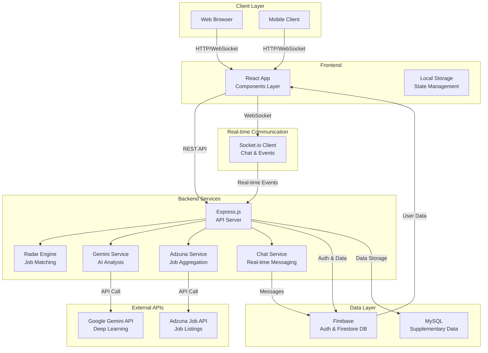
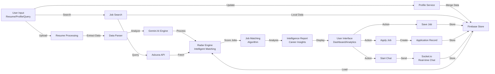
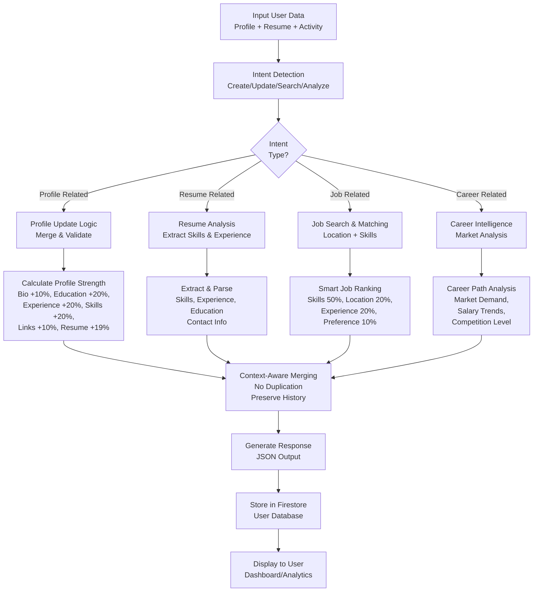
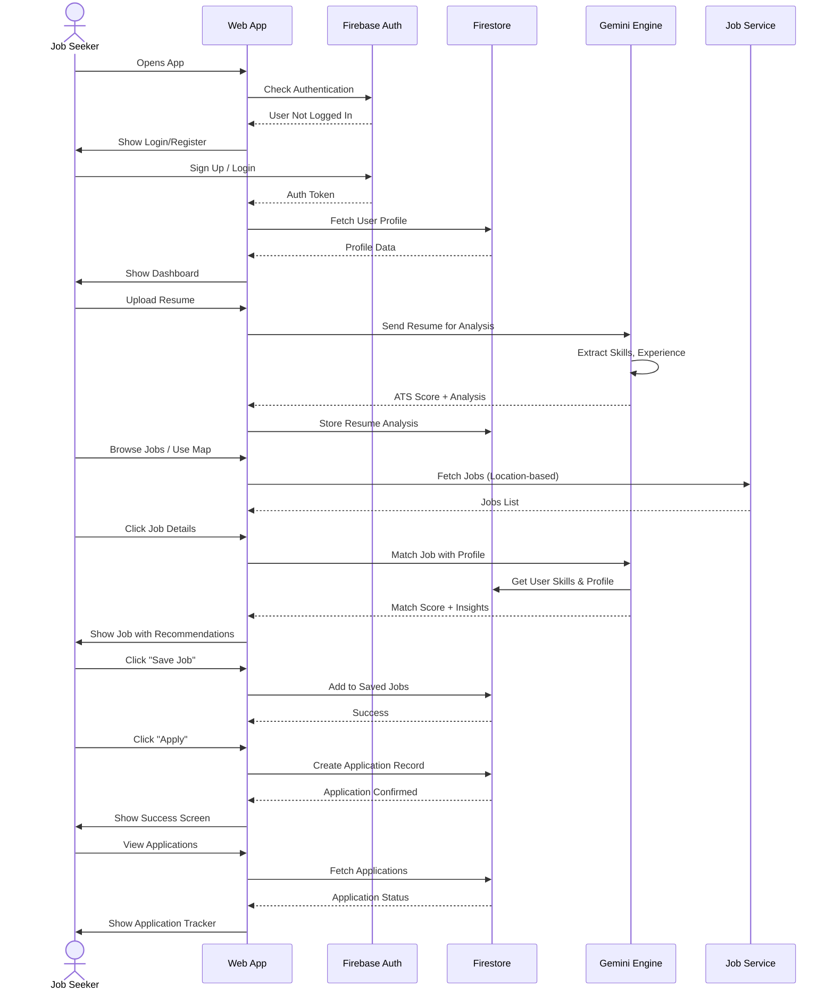
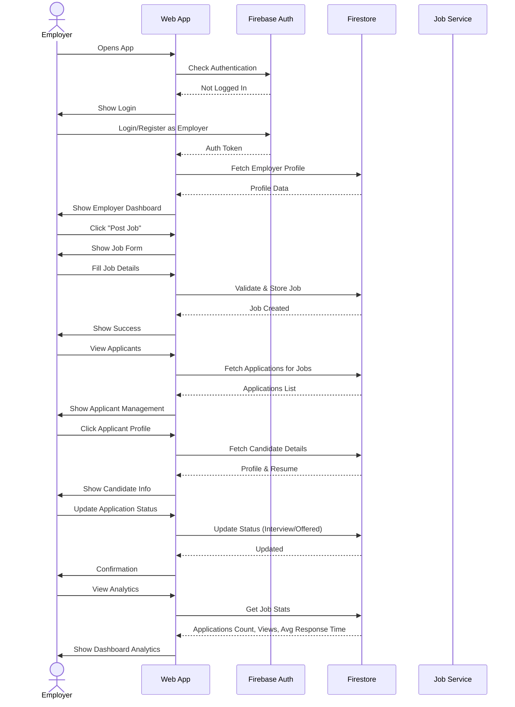
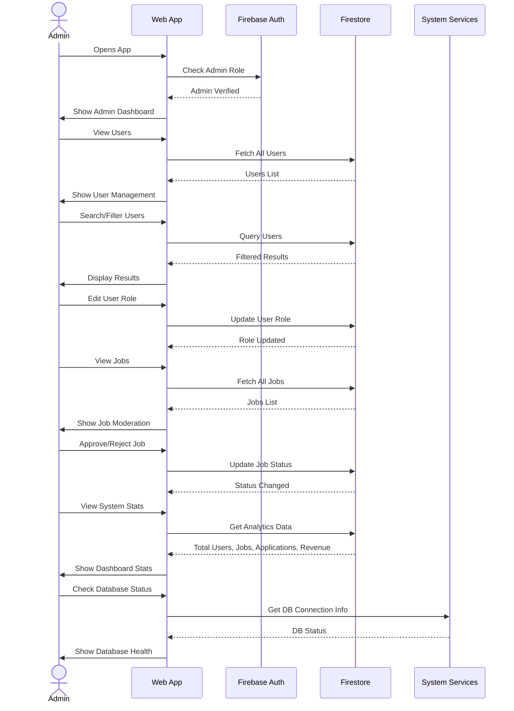

# JOB RADAR - Chennai Regional Job Platform

<div align="center">


**An intelligent, AI-powered job discovery platform designed for the Chennai regional hub with real-time job matching, career intelligence, and professional growth tools.**

[Features](#features) • [Architecture](#architecture) • [Setup](#setup) • [Documentation](#documentation) • [Contributing](#contributing)

</div>

---

## Table of Contents

- [Overview](#overview)
- [Features](#features)
- [Technology Stack](#technology-stack)
- [Architecture](#architecture)
- [System Design](#system-design)
- [User Flows](#user-flows)
- [Project Structure](#project-structure)
- [Installation & Setup](#installation--setup)
- [Configuration](#configuration)
- [Running the Application](#running-the-application)
- [API Documentation](#api-documentation)
- [Database Schema](#database-schema)
- [Key Services](#key-services)
- [Troubleshooting](#troubleshooting)
- [Contributing](#contributing)

---

## Overview

**Job Radar** is an intelligent, multi-user platform that revolutionizes job discovery and employment connections in the Chennai region. It leverages **Google Gemini AI** to provide personalized job recommendations, comprehensive resume analysis, market intelligence, and career roadmaps.

### Key Highlights

- **AI-Powered Intelligence**: Leverages Google Gemini 3.1 Pro for deep career analysis
- **Location-Based Matching**: Smart geographical job discovery across Chennai and Tamil Nadu
- **Real-time Analytics**: Dashboard-based insights for job seekers and employers
- **Multi-Role Support**: Guest, Job Seeker, Employer, and Admin roles
- **Smart Alerts**: Real-time job notifications matching your profile
- **Real-time Chat**: Socket.io powered communication between users
- **Responsive Design**: Works seamlessly on web and mobile devices
- **Secure Authentication**: Firebase-based auth with encrypted data handling

---

## Features

### For Job Seekers
- **Resume Upload & Analysis**: Upload CV and get ATS score + optimization suggestions
- **AI-Powered Job Matching**: Get personalized job recommendations based on skills
- **Career Intelligence Report**: Deep analysis of:
  - Profile strength score (0-100%)
  - Market demand for your skills
  - Salary expectations based on location & experience
  - Competition level in your field
  - Skill gap analysis and recommendations
- **Learning Roadmap**: AI-generated career development path
- **Saved Jobs**: Bookmark jobs for later review
- **Application Tracking**: Track application status (Applied, Under Review, Interview, Offered, Rejected)
- **Interactive Map**: Discover jobs by location on an interactive map
- **Smart Alerts**: Get notified when matching jobs are posted
- **Real-time Chat**: Direct messaging with employers

### For Employers
- **Job Posting**: Easy flow to post new job openings
- **Applicant Management**: View and manage applications with status tracking
- **Candidate Search**: Find candidates matching your requirements
- **Analytics Dashboard**: View application metrics and hiring insights
- **Alert Settings**: Get notified when new candidates apply
- **Real-time Notifications**: Instant alerts for new applications
- **Candidate Chat**: Direct communication with potential hires

### For Admin
- **User Management**: Create, update, and manage user accounts
- **Job Moderation**: Approve/reject job postings
- **System Analytics**: Platform-wide statistics and insights
- **Database Management**: Monitor and manage Firestore data
- **Settings Control**: Configure platform-wide settings

---

## Technology Stack

### Frontend
| Technology | Purpose |
|-----------|---------|
| **React 19.2.4** | UI Framework |
| **TypeScript 5.8.2** | Type-safe development |
| **Vite 6.2.0** | Build tool and dev server |
| **Motion 12.34.3** | Advanced animations |
| **Recharts 3.8.1** | Data visualization |
| **Socket.io-client 4.8.3** | Real-time communication |

### Backend
| Technology | Purpose |
|-----------|---------|
| **Express 5.2.1** | REST API server |
| **Socket.io 4.8.3** | Real-time messaging |
| **Firebase 12.12.0** | Authentication & Firestore DB |
| **MySQL 3.17.5** | Supplementary database |
| **tsx 4.21.0** | TypeScript runtime |

### AI & External Services
| Service | Purpose |
|---------|---------|
| **Google Gemini 3.1 Pro** | AI-powered analysis & recommendations |
| **Adzuna Job API** | Real-time job data aggregation |
| **Firebase Auth** | User authentication |
| **Firestore** | Cloud database |

---

## Architecture

### System Architecture Overview



### Component Hierarchy

```mermaid
graph TD
    APP["App.tsx<br/>Main Entry"]
    
    APP -->|Auth State| AUTH["Authentication<br/>Firebase Auth"]
    APP -->|Role Check| ROLE["Role-based<br/>Routing"]
    
    ROLE -->|Guest| LANDING["LandingPage"]
    ROLE -->|Job Seeker| SEEKER["Seeker Dashboard"]
    ROLE -->|Employer| EMPLOYER["Employer Dashboard"]
    ROLE -->|Admin| ADMIN["Admin Panel"]
    
    SEEKER --> MAP["MapContainer<br/>Location-based Jobs"]
    SEEKER --> JOBS["JobDetails<br/>Job Information"]
    SEEKER --> FILTER["FilterOverlay<br/>Search & Filter"]
    SEEKER --> PROFILE["ProfileView<br/>User Profile"]
    SEEKER --> SAVED["SavedJobsView<br/>Bookmarked Jobs"]
    SEEKER --> APPS["ApplicationsView<br/>Application Tracking"]
    SEEKER --> ALERTS["AlertsView<br/>Smart Notifications"]
    SEEKER --> ANALYTICS["SeekerAnalytics<br/>Career Dashboard"]
    SEEKER --> CHAT["ChatWindow<br/>Messaging"]
    SEEKER --> COMMUNITY["CommunityFeed<br/>Job Posts"]
    
    EMPLOYER --> POSTJOB["PostJobFlow<br/>Create Job"]
    EMPLOYER --> APPLICANTS["ApplicantManagement<br/>Review Applications"]
    EMPLOYER --> EMPANALYTICS["EmployerAnalytics<br/>Hiring Dashboard"]
    EMPLOYER --> EMALERTS["EmployerAlertsView<br/>Application Notifications"]
    EMPLOYER --> EMPCHAT["ChatWindow<br/>Candidate Chat"]
    
    ADMIN --> USERS["AdminPanel<br/>User Management"]
    ADMIN --> SETTINGS["AdminSettings<br/>System Config"]
    ADMIN --> DBSTATUS["DatabaseStatus<br/>DB Monitoring"]
```



---

## System Design

### Data Flow Architecture



### Radar Engine Intelligence Process



---

## User Flows

### Job Seeker Journey



### Employer Journey



### Admin Journey



---

## Project Structure

```
JOB-R1-main/
├── App.tsx                    # Main React component with routing & state
├── index.tsx                  # React DOM entry point
├── index.html                 # HTML template
├── server.ts                  # Express.js server setup
├── vite.config.ts             # Vite build configuration
├── tsconfig.json              # TypeScript configuration
├── package.json               # Dependencies & scripts
├── types.ts                   # TypeScript interfaces & enums
├── constants.ts               # Mock data & constants
├── metadata.json              # Project metadata
├── firebase-applet-config.json # Firebase config
├── components/                # React components
│   ├── Header.tsx             # Navigation header
│   ├── LandingPage.tsx         # Welcome page
│   ├── MapContainer.tsx        # Interactive job map
│   ├── FilterOverlay.tsx       # Search & filter UI
│   ├── JobDetails.tsx          # Job detail view
│   ├── ProfileView.tsx         # User profile management
│   ├── SavedJobsView.tsx       # Bookmarked jobs
│   ├── ApplicationsView.tsx     # Application tracking
│   ├── BottomSheet.tsx         # Reusable bottom sheet component
│   ├── EmployerDashboard.tsx   # Employer main dashboard
│   ├── PostJobFlow.tsx         # Job posting wizard
│   ├── ApplicantManagement.tsx # Manage applications
│   ├── EmployerAnalytics.tsx   # Employer insights
│   ├── EmployerAlertsView.tsx  # Employer notifications
│   ├── SeekerAnalytics.tsx     # Job seeker analytics
│   ├── AlertsView.tsx          # Smart job alerts
│   ├── ChatWindow.tsx          # Real-time messaging
│   ├── CommunityFeed.tsx       # Job posts feed
│   ├── AdminPanel.tsx          # Admin user management
│   ├── AdminSettings.tsx       # System configuration
│   ├── DatabaseStatus.tsx      # DB monitoring
│   └── SuccessScreen.tsx       # Success confirmation
│
├── services/                  # Business logic & API services
│   ├── adzunaService.ts        # Adzuna job API integration
│   ├── radarEngine.ts          # Core intelligent matching engine
│   ├── geminiService.ts        # Google Gemini AI integration
│   ├── chatService.ts          # Real-time chat logic
│   └── firebase.ts             # Firebase auth & Firestore setup
│
└── Configuration Files
    ├── firestore.rules            # Security rules for Firestore
    ├── firebase-blueprint.json    # Firebase structure template
    └── .env.local                 # Environment variables (not in repo)
```

---

## Installation & Setup

### Prerequisites

- **Node.js** 18.x or higher
- **npm** 9.x or higher
- **Git** for version control
- **Firebase Account** (for authentication & Firestore)
- **Google Gemini API Key** (for AI features)
- **Adzuna API Credentials** (for job data)

### Step 1: Clone Repository

```bash
git clone <repository-url>
cd JOB-R1-main
```

### Step 2: Install Dependencies

```bash
npm install
```

This will install all required packages listed in `package.json`:
- React & ReactDOM
- TypeScript
- Vite & build tools
- Firebase SDK
- Socket.io
- Recharts
- Motion
- Express
- MySQL2
- Google GenAI

### Step 3: Configure Environment Variables

Create a `.env.local` file in the root directory:

```env
# Firebase Configuration
VITE_FIREBASE_API_KEY=your_firebase_api_key
VITE_FIREBASE_AUTH_DOMAIN=your_project.firebaseapp.com
VITE_FIREBASE_PROJECT_ID=your_project_id
VITE_FIREBASE_STORAGE_BUCKET=your_bucket.appspot.com
VITE_FIREBASE_MESSAGING_SENDER_ID=your_sender_id
VITE_FIREBASE_APP_ID=your_app_id

# Gemini AI Configuration
GEMINI_API_KEY=your_gemini_api_key

# Adzuna Job API
VITE_ADZUNA_APP_ID=your_adzuna_app_id
VITE_ADZUNA_APP_KEY=your_adzuna_app_key

# MySQL Configuration (Optional)
DB_HOST=localhost
DB_USER=root
DB_PASSWORD=your_password
DB_NAME=job_radar

# Server Configuration
PORT=5000
NODE_ENV=development
```

### Step 4: Setup Firebase Project

1. Go to [Firebase Console](https://console.firebase.google.com/)
2. Create a new project or use existing
3. Enable Authentication (Email/Password, Google)
4. Create Firestore Database
5. Set Security Rules (see [Firestore Rules](#firestore-rules))
6. Download config and update `.env.local`

### Step 5: Setup Gemini API

1. Go to [Google AI Studio](https://makersuite.google.com/app/apikey)
2. Create API Key
3. Add to `.env.local` as `GEMINI_API_KEY`

### Step 6: Setup Adzuna API (Optional)

1. Register at [Adzuna Developer](https://developer.adzuna.com/)
2. Get App ID and API Key
3. Add to `.env.local`

---

## Configuration

### Firebase Rules

**Firestore Security Rules** (`firestore.rules`):

```firestore
rules_version = '2';
service cloud.firestore {
  match /databases/{database}/documents {
    // Users can only read/write their own profile
    match /users/{userId} {
      allow read, write: if request.auth.uid == userId;
    }
    
    // Jobs are public read, only employers can write
    match /jobs/{document=**} {
      allow read: if true;
      allow create, update: if request.auth.uid != null && 
                            request.resource.data.employerId == request.auth.uid;
      allow delete: if request.auth.uid != null && 
                     resource.data.employerId == request.auth.uid;
    }
    
    // Applications are private
    match /applications/{document=**} {
      allow read, write: if request.auth.uid != null;
    }
    
    // Chat messages
    match /messages/{message} {
      allow read, write: if request.auth.uid != null;
    }
    
    // Admin only
    match /admin/{document=**} {
      allow read, write: if request.auth.token.admin == true;
    }
  }
}
```

### Vite Configuration

The `vite.config.ts` includes:
- React plugin for JSX/TSX
- TypeScript support
- Environment variable handling
- Optimized build output

---

## Running the Application

### Development Mode

Start both frontend and backend in development:

```bash
npm run dev
```

This command (via `tsx server.ts`):
- Starts Express.js server on `http://localhost:5000`
- Starts Vite dev server on `http://localhost:5173`
- Enables hot module replacement (HMR)
- Auto-compiles TypeScript

### Production Build

Create optimized production bundle:

```bash
npm run build
```

This generates:
- Minified JavaScript bundles
- Optimized CSS
- Source maps (optional)
- Output in `dist/` directory

### Start Production Server

```bash
npm start
```

Serves the built app from `dist/` directory on port configured in `server.ts`

### Type Checking

Run TypeScript compiler without building:

```bash
npm run lint
```

Useful for CI/CD pipelines and pre-commit hooks

---

## API Documentation

### Authentication Endpoints

#### Register User
```bash
POST /api/auth/register
Content-Type: application/json

{
  "email": "user@example.com",
  "password": "secure_password",
  "name": "John Doe",
  "role": "JOB_SEEKER" | "EMPLOYER" | "ADMIN"
}
```

#### Login
```bash
POST /api/auth/login
Content-Type: application/json

{
  "email": "user@example.com",
  "password": "secure_password"
}
```

### Job Endpoints

#### Get All Jobs
```bash
GET /api/jobs?page=1&limit=20&category=IT&area=Chennai
```

#### Get Job Details
```bash
GET /api/jobs/:jobId
```

#### Create Job (Employer Only)
```bash
POST /api/jobs
Authorization: Bearer token
Content-Type: application/json

{
  "title": "Senior Developer",
  "company": "Tech Company",
  "description": "Looking for...",
  "salary": "₹10L - ₹15L PA",
  "location": { "lat": 13.0827, "lng": 80.2707, "area": "Chennai" },
  "skills_required": ["React", "Node.js"],
  "type": "FULL_TIME",
  "workMode": "HYBRID",
  "experience": "SENIOR"
}
```

### Profile Endpoints

#### Get User Profile
```bash
GET /api/users/:userId
Authorization: Bearer token
```

#### Update Profile
```bash
PUT /api/users/:userId
Authorization: Bearer token
Content-Type: application/json

{
  "bio": "Passionate developer...",
  "skills": ["React", "TypeScript"],
  "phone": "+91-XXXX-XXXX-XX"
}
```

#### Upload Resume
```bash
POST /api/users/:userId/resume
Authorization: Bearer token
Content-Type: multipart/form-data

file: <PDF/DOC file>
```

### Application Endpoints

#### Create Application
```bash
POST /api/applications
Authorization: Bearer token
Content-Type: application/json

{
  "jobId": "job123",
  "notes": "I'm interested in this role..."
}
```

#### Get User Applications
```bash
GET /api/applications?userId=user123&status=APPLIED
Authorization: Bearer token
```

#### Update Application Status
```bash
PUT /api/applications/:appId
Authorization: Bearer token
Content-Type: application/json

{
  "status": "INTERVIEW" | "OFFERED" | "REJECTED"
}
```

### AI Analysis Endpoints

#### Analyze Resume
```bash
POST /api/ai/analyze-resume
Authorization: Bearer token
Content-Type: application/json

{
  "resumeText": "John Doe...",
  "targetRole": "Software Engineer"
}
```

#### Get Job Matches
```bash
POST /api/ai/match-jobs
Authorization: Bearer token
Content-Type: application/json

{
  "userId": "user123",
  "jobIds": ["job1", "job2", "job3"]
}
```

#### Generate Career Roadmap
```bash
POST /api/ai/career-roadmap
Authorization: Bearer token
Content-Type: application/json

{
  "currentSkills": ["React", "JavaScript"],
  "targetRole": "Senior Full Stack Developer"
}
```

#### Full Intelligence Report
```bash
POST /api/ai/intelligence-report
Authorization: Bearer token
Content-Type: application/json

{
  "userId": "user123",
  "includeMarketData": true
}
```

### Chat Endpoints

#### Get Messages
```bash
GET /api/chat/rooms/:roomId/messages
Authorization: Bearer token
```

#### Send Message
```bash
POST /api/chat/rooms/:roomId/messages
Authorization: Bearer token
Content-Type: application/json

{
  "content": "Hello!",
  "senderId": "user123"
}
```

#### Get Chat Rooms
```bash
GET /api/chat/rooms
Authorization: Bearer token
```

### Search & Filter

#### Search Jobs
```bash
GET /api/jobs/search?
  query=React&
  location=Chennai&
  salary_min=500000&
  salary_max=1500000&
  workMode=HYBRID&
  type=FULL_TIME&
  experience=MID
```

---

## Database Schema

### Firestore Collections

#### users
```typescript
{
  id: string (UID from Firebase Auth)
  name: string
  email: string
  role: 'JOB_SEEKER' | 'EMPLOYER' | 'ADMIN'
  bio?: string
  skills: string[]
  phone?: string
  avatar?: string
  experience: Experience[]
  education: Education[]
  savedJobs: string[] (Job IDs)
  applications: string[] (Application IDs)
  resumeText?: string
  resumeAnalysis?: ResumeAnalysis
  profileStrength: number (0-100)
  aiInsights?: CareerInsights
  location?: { lat: number, lng: number, area: string }
  createdAt: Timestamp
  updatedAt: Timestamp
}
```

#### jobs
```typescript
{
  id: string (Auto-generated)
  title: string
  company: string
  description: string
  salary: string
  category: 'IT' | 'LOCAL'
  type: 'FULL_TIME' | 'PART_TIME' | 'CONTRACT' | 'INTERN'
  workMode: 'ON_SITE' | 'REMOTE' | 'HYBRID'
  experience: 'ENTRY' | 'MID' | 'SENIOR' | 'LEAD'
  location: {
    lat: number
    lng: number
    address: string
    area: string
  }
  skills_required: string[]
  status: 'OPEN' | 'CLOSED' | 'PENDING' | 'REJECTED'
  employerId: string (User ID of employer)
  urgent: boolean
  posted_at: Timestamp
  updatedAt: Timestamp
}
```

#### applications
```typescript
{
  id: string (Auto-generated)
  jobId: string
  jobTitle: string
  company: string
  userId: string (Applicant's UID)
  employerId: string (Job poster's UID)
  status: 'APPLIED' | 'UNDER_REVIEW' | 'INTERVIEW' | 'OFFERED' | 'REJECTED'
  appliedDate: Timestamp
  notes?: string
  resume?: string (URL to resume file)
  createdAt: Timestamp
  updatedAt: Timestamp
}
```

#### messages
```typescript
{
  id: string
  roomId: string
  senderId: string
  recipientId: string
  content: string
  timestamp: Timestamp
  read: boolean
}
```

#### chat_rooms
```typescript
{
  id: string
  participants: [userId1, userId2]
  lastMessage: string
  lastMessageTime: Timestamp
  createdAt: Timestamp
}
```

#### alerts
```typescript
{
  id: string
  userId: string
  jobId: string
  matchScore: number
  read: boolean
  createdAt: Timestamp
}
```

---

## Key Services Explained

### 1. Radar Engine (`services/radarEngine.ts`)

**Purpose**: Core intelligent job matching and profile analysis engine

**Key Functions**:
- `runRadarEngine()`: Main function that processes user data and generates intelligent insights

**Intelligence Steps**:
1. **Intent Detection**: Identifies user action type
2. **Context Processing**: Merges new with existing data
3. **Profile Updates**: Calculates profile strength percentage
4. **Resume Parsing**: Extracts skills, experience, education
5. **Job Matching**: Scores jobs based on user profile
6. **Skill Gap Analysis**: Identifies missing skills
7. **Career Intelligence**: Suggests career paths
8. **Smart Alerts**: Notifies about matching jobs

**Profile Strength Calculation**:
- Bio: +10%
- Education: +20%
- Experience: +20%
- Skills (3+): +20%
- Social Links: +10%
- Resume: +19%
- Maximum: 100%

### 2. Gemini Service (`services/geminiService.ts`)

**Purpose**: AI-powered analysis using Google Gemini 3.1 Pro

**Key Functions**:
- `analyzeResume()`: ATS score & optimization suggestions
- `getJobMatches()`: AI-powered job recommendation
- `runFullRadarIntelligenceEngine()`: Comprehensive career analysis

**Capabilities**:
- Resume parsing and scoring
- Skill extraction and validation
- Market trend analysis
- Salary benchmarking
- Competition level assessment
- Learning resource recommendations
- Career path planning

**Input Processing**:
```typescript
interface AnalysisInput {
  resumeText: string;
  skills: string[];
  experience: Experience[];
  targetJobs: Job[];
  marketData: MarketIntelligence;
}
```

**Output Sample**:
```typescript
interface FullIntelligenceReport {
  profile_strength: number;
  intelligence: {
    primary_role: string;
    experience_level: ExperienceLevel;
    top_skills: string[];
    profile_quality: 'Low' | 'Medium' | 'High';
  };
  market_intelligence: {
    market_demand_skills: string[];
    user_vs_market_gap: string[];
    salary_expectation: string;
    competition_level: 'Low' | 'Medium' | 'High';
  };
  skill_gap: {
    missing_skills: string[];
    recommended_skills: string[];
  };
  career_roadmap: {
    roadmap: RoadmapStep[];
  };
  job_fit: JobFitResult[];
}
```

### 3. Adzuna Service (`services/adzunaService.ts`)

**Purpose**: Real-time job aggregation from Adzuna API

**Key Functions**:
- `fetchAdzunaJobs()`: Fetch jobs by query and area

**Features**:
- Real-time job data integration
- Multi-location search
- Category detection (IT vs Local)
- Salary parsing and normalization
- HTML tag removal from descriptions
- Error handling and fallbacks

**API Integration**:
- Base URL: `https://api.adzuna.com/v1/api/jobs/in/search/1`
- Methods: GET with parameters
- Response transformation to internal format

### 4. Firebase Service (`services/firebase.ts`)

**Purpose**: Authentication and database operations

**Key Functions**:
- `syncUserProfile()`: Create/sync user profile
- `onAuthStateChanged()`: Monitor auth state
- Real-time Firestore listeners
- Data persistence and retrieval

**Security Features**:
- Firebase Authentication
- Firestore Security Rules
- Encrypted sensitive data
- User isolation

### 5. Chat Service (`services/chatService.ts`)

**Purpose**: Real-time messaging using Socket.io

**Features**:
- Real-time bidirectional communication
- Room-based messaging
- Message history persistence
- Read receipts
- User presence detection

---

## AI Intelligence Features

### Resume Analysis
- **ATS Score**: 0-100 based on keyword matching
- **Skill Extraction**: Automatic detection from resume
- **Experience Validation**: Verification against market standards
- **Optimization Suggestions**: Actionable improvements
- **Format Analysis**: Document structure assessment

### Job Matching Algorithm
```
Match Score = (Skills Match × 50%) + 
              (Location Match × 20%) + 
              (Experience Match × 20%) + 
              (Preference Match × 10%)

Skills Match: Matching skills / Required skills × 100
Location Match: Distance-based scoring
Experience Match: Levels 0-4, Salary range match
Preference Match: Job type, work mode preferences
```

### Career Intelligence
- Market demand analysis for skills
- Salary benchmarking by location & experience
- Competition level assessment
- Skill gap identification
- Learning path recommendations
- Next role suggestions

### Smart Alerts
- Automatic job matching (>70% threshold)
- Location-based notifications
- Skill-based opportunities
- Salary range alerts
- Company preference matching

---

## Troubleshooting

### Common Issues & Solutions

#### Issue: Firebase Authentication Error
**Symptoms**: "Cannot read properties of undefined (reading 'auth')"

**Solution**:
1. Verify `.env.local` has correct Firebase credentials
2. Check Firebase project settings
3. Ensure authentication methods are enabled
4. Clear browser localStorage: `localStorage.clear()`

#### Issue: Gemini API Not Working
**Symptoms**: AI features return empty results

**Solution**:
1. Verify `GEMINI_API_KEY` is set correctly
2. Check API quota in Google AI Studio
3. Verify API is enabled in Google Cloud Console
4. Check network requests in browser DevTools

#### Issue: Jobs Not Loading
**Symptoms**: Map shows no jobs, empty job list

**Solution**:
1. Check Firestore database has data (Seed from constants if needed)
2. Verify Firestore rules allow read access
3. Check network tab for failed requests
4. Run: `npm run dev` to ensure server is running

#### Issue: Resume Upload Fails
**Symptoms**: Upload button does nothing or shows error

**Solution**:
1. Verify Firebase Storage is set up
2. Check file size (max 5MB recommended)
3. Ensure file format is PDF or DOC
4. Check browser console for specific errors

#### Issue: Real-time Chat Not Working
**Symptoms**: Messages don't appear in real-time

**Solution**:
1. Verify Socket.io server is running
2. Check WebSocket connection in DevTools
3. Ensure firestore messages collection exists
4. Check browser console for Socket errors

#### Issue: Profile Strength Not Updating
**Symptoms**: Profile strength shows 0% or doesn't change

**Solution**:
1. Fill profile fields: bio, education, experience
2. Ensure profile changes are saved to Firestore
3. Check if profileStrength field exists in database
4. Manually trigger update: `await updateDoc(userRef, { profileStrength: 1 })`

---

## Additional Resources

### Learning Resources
- [React Documentation](https://react.dev)
- [TypeScript Handbook](https://www.typescriptlang.org/docs)
- [Firebase Documentation](https://firebase.google.com/docs)
- [Google Gemini API](https://ai.google.dev)
- [Express.js Guide](https://expressjs.com/)

### API References
- [Adzuna Job API](https://developer.adzuna.com/)
- [Firebase Admin SDK](https://firebase.google.com/docs/admin/setup)
- [Socket.io Documentation](https://socket.io/docs/)

---

## Contributing

### Code Style
- Use TypeScript for type safety
- Follow ESLint rules (run `npm run lint`)
- Use meaningful variable and function names
- Add comments for complex logic
- Keep components small and reusable

### Before Submitting PR
1. Run `npm run lint` - Fix all TypeScript errors
2. Test on multiple browsers
3. Update README if adding features
4. Test with real Firebase data
5. Check performance in DevTools

### Commit Messages
```
feat: Add new feature description
fix: Fix bug description
docs: Update documentation
style: Code formatting changes
refactor: Code restructuring
test: Add tests
chore: Maintenance tasks
```

---

## License

This project is open-source and available under the **MIT License**.

---

## Author

**Job Radar Development Team**
- Focus: AI-powered job discovery for regional hubs
- Region: Chennai, Tamil Nadu
- Vision: Revolutionize job hunting through intelligent matching

---

## Support

For issues, questions, or suggestions:
1. Check the [Troubleshooting](#troubleshooting) section
2. Review existing GitHub issues
3. Create a new issue with detailed description
4. Contact development team via email

---

<div align="center">

**Made with care for Job Seekers & Employers in Chennai**

[Back to Top](#job-radar---chennai-regional-job-platform)

</div>
